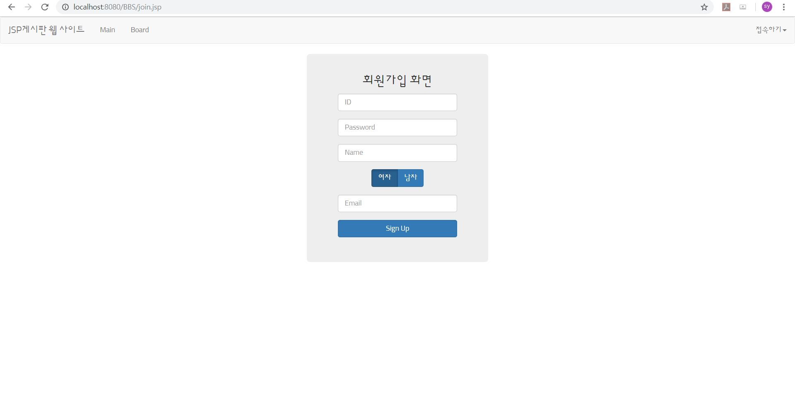

# JSP_Board
## 1. 게시판 메인 화면
### * 사용한 기술

### - Bootstrap carousel 사용해서 좌우로 넘길 수 있는 사진 삽입

### - 로그인 / 회원가입 할 수 있는 메뉴바의 dropdown

## 2. 로그인 화면

## 3. 회원가입 화면

## 4. 로그인 이후 화면
### - 접속하기 -> 회원관리로 변경

### - 로그인 이후 메뉴바 : session 관리

## 5. 게시판 화면
### - 초기 게시판 상태

### - 게시판에 글 쓰기

### - 글 작성 후 게시판 상태

### - 게시글 제목 클릭 : 게시글 확인

### - 로그인된 회원 session 확인 후 게시글 수정

### - 로그인된 회원 session 확인 후 게시글 삭제

### - 게시글 삭제 후 게시판 상태

### - 게시글 10개 단위로 다음/이전 버튼 생성 : 내림차순으로 최신글 부터 확인

### - 로그아웃 후 게시글 보기 : 메뉴바 변경 + 게시글 수정/삭제 버튼 제거

## 6. 논리적 오류 발견 및 해결

## 7. 느낀 점
### 남의 코드 생각 없이 가져다 쓰면 의미가 없기 때문에 오류를 발견하고 해결한 점은 뿌듯하다.
### 근데 오류 잡는데 엄청 오래 걸렸다...알고리즘 열심히 해야겠다..
### 큰 문제는 작게 쪼개서 해결하자

## 8. 환경세팅.docx
###JSP 게시판 개발 환경 세팅에 필요했던 부분을 정리했다.
### 1. 톰캣 64비트 설치 및 이클립스에서 서버 추가하는 방법
### 2. mysql로 DB구축 / mysql 드라이버 설치 방법 및 이클립스에 DB연결하는 방법
### 3. 커스텀 css파일 추가하고 JSP 파일에 삽입하는 방법 + 구글 폰트 api 사용 방법
### 4. JSP파일에 사진 추가하기
### 5. cafe24서버를 이용한 배포 방법 링크
### 6. AWS EC2서버에 배포하는 방법 (추후 추가 예정)

